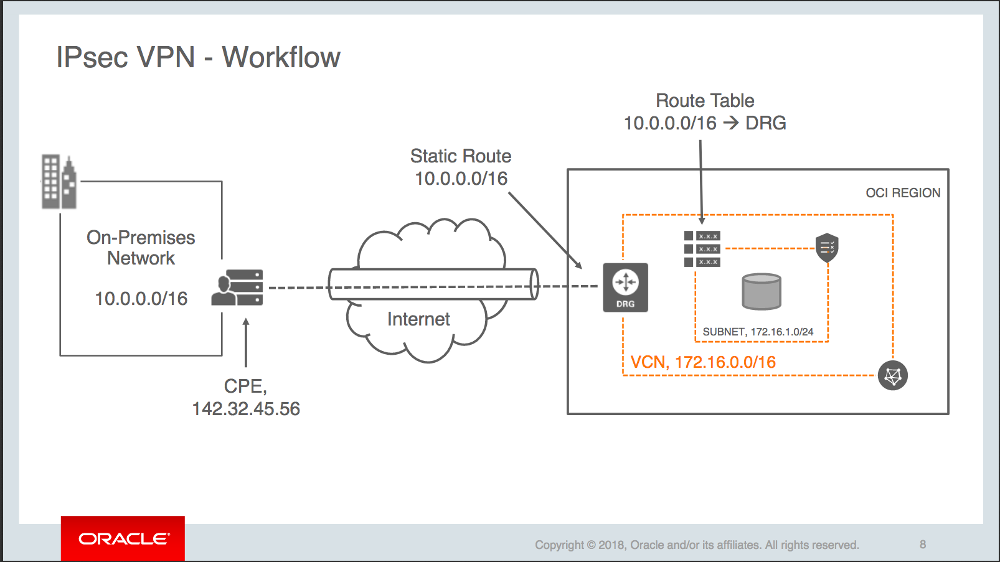
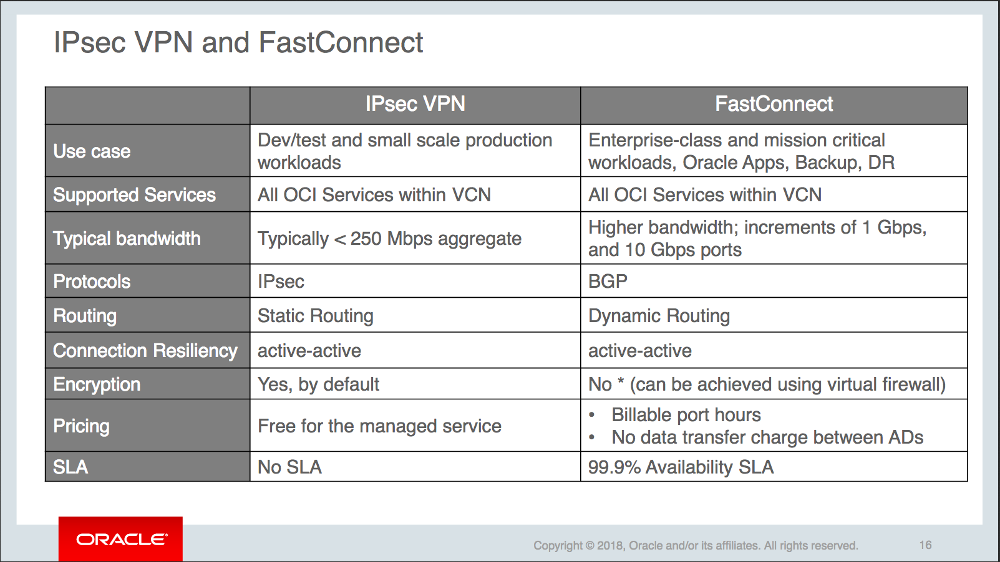

# Connectivity Options for OCI

- [Connectivity Options for OCI](#connectivity-options-for-oci)
  - [Overview](#overview)
  - [IPSec VPN](#ipsec-vpn)
    - [Workflow](#workflow)
  - [Fast Connect](#fast-connect)

## Overview
OCI offers 3 main choices for connectivity to the cloud.

1. Public Internet
    * Simply leverage the internet.
    * __InternetGateways__ : allow bi-directional communication, to expose services that can be reached publically, and reach out to public destinations
    * __NAT gateways__ : allow instances to reach public desitnations, but instances are not exposed publically.
    * Networks can leverage __Ehpemeral__ or __Reserved__ public IP addresses to attach to thier private IP addresses.
    * The __first 10TB of data out__ through the internet is free
2. IPSec VPN
   * Establish a VPN between CPE and and OCI VCN (Using a DRG)
   * Oracle Managed IPSec VPN - free managed service
   * Softwarte VPN running on a compute instance.
3. Fast Connect
   * Private network connectivity
   * fast - 1Gbps and 10Gbps available.
   * SLAs are provided.

## IPSec VPN

IPSec VPN is basically connectivity over the internet. However, a secure tunnel in created between the two(or more) network that are forming the VPN to ensure security. The tunnel baiscally encrypts traffic to ensure integrity of the data(tampering while in transit) as well as the authenticity of the data(data came from a verifiable source, and not spoofed).

* Routing of the data can be dynamic (BGP, future) or static (__only option today__).
* OCI provides redundant tunnels that are physically as well as logically separate.
* The service is fully managed and the user cannot choose the public IP addresses and so on.
* Good starting point (POC), and based on actual need can be changed in to a FastConnect design.
* Pricing is based on datatransfer
  * Inbound - always free 
  * Outbound - First 10TB free every month
    * Charges /GB for anything over the forst 10TB every month

### Workflow

The steps to setup an IPSec VPN are as follows:

1. Create a DRG and attach to VCN (VCN:DRG = 1:1)
2. Update subnet Route table to add a route - Destination CIDR = CPE CIDR => DRG
3. Create a CPE object and add the public IP for the CPE Router
4. Create IPSec Connection between the CPE and DRG with a static route.
5. Configure CPE Router to direct traffic destined for VCN Subnet CIDR to DRG public IP address.

## Fast Connect

Private network between the customer's CPE and the OCI VCN. Usually service provider that privides the network is involved.

* Higher bandwidth with more predictable network
  * bandwidth in increments of 1Gbps and 10Gbps
  * SLAs avaialable
  * Uses BGP protocol
* No charges for datatransfer
* This requires an Virtual Circuit to be setup
  * A virtual circuit is made up of OCI, the Network Partner and the CPE to form a circuit.
  * Its an isolated network path that connects the customer's edge router with their DRG in OCI.
  * Multiple virtual circuits are possible to isolate different traffic channels (say, per subnet) or for redundancy
* Two usecases
  * __Private Peering__ - Extend the CPE datacenter. OCI VCN hosts appilcations and such and are hooekd up to CPE over a private network.
    * uses a __Private Virtual Circuit__
  * __Public Peering__ - Use the public OCI services like ObjectStorage, over a private network, as opposed to the internet.
    * uses a __Public Virtual Circuit__
    * This can be useful for cases where very large amounts of data are being transmitted between OCI public services and CPE(no data transfer fees)
    * A DRG is not used in the case of Public Peering, since OCI services have a public endpoint.
* Billing is based on _PortHours_ - hourly usage, but not based on the amount of data transferred.
